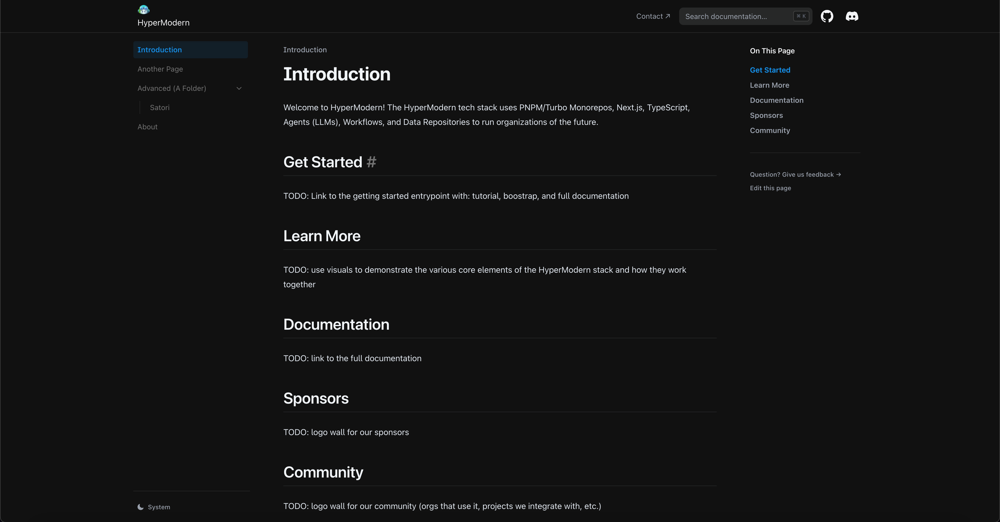

# hypermodernstack.com

The HyperModern tech stack uses PNPM/Turbo Monorepos, Next.js, TypeScript, Agents (LLMs), Workflows, xState Machines, and Data Repositories to run organizations of the future.

This site is built using [Nextra](https://nextra.site), a template for creating documentation using Next.js.

[**Live Website →**](https://hyper-modern.github.io)

